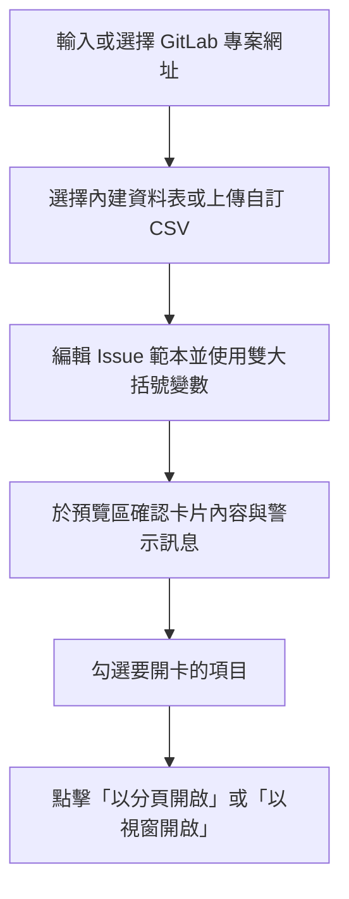

# GitLab 批量開卡工具 (GitLab Bulk Issue Generator)

[](https://react.dev/)
[](https://vite.dev/)
[](https://www.typescriptlang.org/)
[](https://tailwindcss.com/)

一個專為 GitLab 設計的網頁端**批量開卡（Issue）輔助工具**。透過視覺化界面、自訂範本與 CSV 資料匯入，一鍵產生多個 GitLab 新增卡片的連結，並支援瀏覽器分頁或彈出視窗批量開啟，大幅提升專案啟動與任務分發的效率！

## 核心特色

- **專案快速切換與自訂 URL**
  - 內建常用專案（如 SITCON Camp 2026、SITCON 2026 等）的開卡連結。
  - 支援輸入任何自訂的 GitLab 專案開卡連結（必須以 `/-/issues/new` 結尾）。
  - 提供即時 URL 格式驗證與提示。

- **模板化變數替換 (Template Engine)**
  - 支援使用雙大括號 `{{變數名稱}}`（如 `{{task_title}}`）來對應 CSV 資料表中的欄位。
  - 適用於標題、描述、指派人、標籤以及關聯卡片 ID。

- **自動轉換 GitLab 快速指令 (Quick Actions)**
  - 指派人範本會自動轉換並附加 `/assign @username` 指令至描述末尾。
  - 標籤範本支援逗號分隔多個標籤，自動轉換為 `/label ~"標籤名稱"` 並附加至描述末尾。

- **雙重資料來源支援**
  - **內建靜態表單**：自動載入置於專案中的常用 CSV 檔案。
  - **自訂 CSV 上傳**：支援拖放或點擊上傳自訂 CSV，自動解析欄位與內容，無需後端處理。

- **即時預覽與智慧警告**
  - 在開啟前即時預覽每張卡片渲染後的標題、描述與網址。
  - 檢查常見錯誤：缺少標題、未知變數（範本中的變數不存在於資料表）、變數值為空、關聯卡片 ID 格式錯誤等。
  - 檢測產生的 URL 長度是否超過瀏覽器限制（2,000 字元）。

- **批量開啟與本機保存**
  - 一鍵開啟所有無警告的卡片（支援**多個新分頁**或**獨立小視窗**模式）。
  - 自動透過 `localStorage` 記憶您上次輸入的 URL、範本、自訂 CSV 及選取的欄位，重整網頁不丟失進度。

## 技術棧

- **前端框架**：React 19, TypeScript
- **建置工具**：Vite 8
- **樣式設計**：Tailwind CSS v4 (使用 `@tailwindcss/vite` 編譯)
- **UI 組件**：Shadcn UI (包含 Radix UI primitives)
- **CSV 解析**：PapaParse
- **圖示庫**：Lucide React

## 快速開始

### 前提條件

- 已安裝 [Node.js](https://nodejs.org/) (建議 v18 或以上版本)。
- 本專案使用 [pnpm](https://pnpm.io/) 作為套件管理工具。

### 安裝與啟動

1. **複製專案**

   ```bash
   git clone https://github.com/your-username/gitlab-bulk-issue-generator.git
   cd gitlab-bulk-issue-generator
   ```

2. **安裝依賴**

   ```bash
   pnpm install
   ```

3. **啟動開發伺服器**

   ```bash
   pnpm dev
   ```

   瀏覽器將會自動開啟 `http://localhost:5173`。

4. **建置生產版本**
   ```bash
   pnpm build
   ```
   建置完成的靜態檔案將輸出於 `dist/` 資料夾。

## 使用指南



### 1. 準備 CSV 資料表

請確保您的 CSV 檔案包含標頭（Headers），例如：
| task_title | team_name | 組長 | assignee | labels | related_issue_id |
| : | : | : | : | : | : |
| 開發組待辦 | 開發 | yorukot | yorukot | Status::Inbox,組別::開發組 | 12345 |

### 2. 撰寫範本範例

在編輯器中，您可以使用如下的範本設定：

- **標題**：`[2026 Camp] {{task_title}}`
- **指派人**：`{{assignee}}` （多個指派人可用逗號 `,` 分隔）
- **標籤**：`Status::Inbox, 組別::{{team_name}}組`
- **關聯卡片 ID**：`{{related_issue_id}}`
- **描述**：

  ```markdown
  ## 摘要

  {{task_title}} 的具體任務細節。

  - 負責團隊：{{team_name}}
  - 負責人：@{{組長}}
  ```

> [!NOTE]
> 工具會自動將**指派人**與**標籤**轉換為 GitLab 支援的 Markdown 快速指令（例如 `/assign @yorukot` 和 `/label ~"Status::Inbox" ~"組別::開發組"`）並附在描述的最尾端。

## 自訂與擴充

### 新增常用預設專案

若要修改或新增專案下拉選單的預設項目，請修改 [src/data/projects.json](file:///Users/nathan/Developments/gitlab-bulk-issue-generator/src/data/projects.json)：

```json
[
  {
    "name": "新專案名稱",
    "issueNewUrl": "https://gitlab.com/your-org/your-project/-/issues/new"
  }
]
```

### 新增常用預設資料表

將您的 CSV 檔案放置於 `src/data/tables/` 目錄下（例如 [src/data/tables/sitcon-2026.csv](file:///Users/nathan/Developments/gitlab-bulk-issue-generator/src/data/tables/sitcon-2026.csv)），系統在建置與運行時會透過 `import.meta.glob` 自動偵測並載入為內建資料表。

## 注意事項

> [!WARNING]
> **瀏覽器阻擋彈出視窗**
> 由於批量開啟連結會調用 `window.open`，瀏覽器預設可能會將其視為廣告彈出視窗而進行阻擋。
> **請在首次使用時，允許瀏覽器對此網站的「彈出式視窗與重新導向」權限。**

> [!IMPORTANT]
> **URL 長度限制**
> 如果 Issue 的描述或標題過長，產生的 URL 長度可能會超過 2,000 字元。這會觸發工具的警示。請適度縮減範本字數，或在開卡後手動編輯詳細內容，以免開卡連結失效。

## 授權條款

本專案採用 MIT 授權條款。詳情請參閱專案授權聲明。
